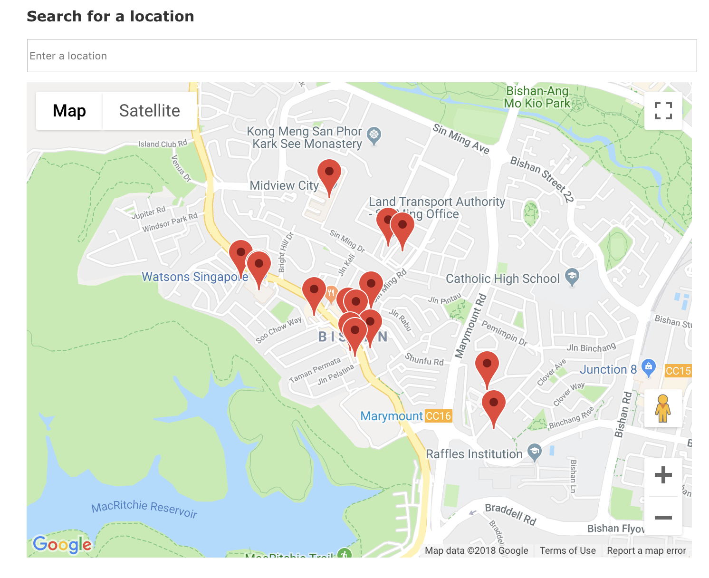
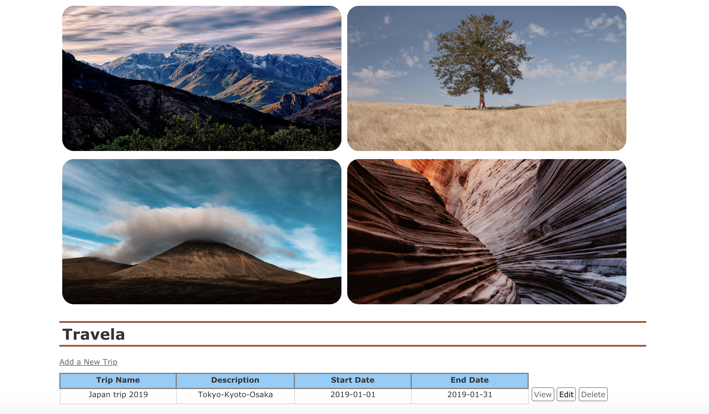

# :earth_asia: Travela: Research and Plan All-in-One
Mission: To allow the planning of travel itineraries to be more convenient & efficient by reducing the hassle of toggling between browser tabs.


## :paperclip: What is Travela?
Travela started off as a class project and the objective was to facilitate travellers who'd like to have a more organised itinerary planning experience. You'll be able to search for Places of Interest and then immediately add them into your itinerary all in one application. <br>


This application uses <b>React on Rails</b>, <b>PostgreSQL</b>, <b>Google Maps</b> and <b>Foursquare</b> APIs.


## :pencil2: Getting Started
Try it out!
Go through the simple steps below (you'll need two separate CLIs for this):
```
git clone https://github.com/audthenerd/travela_latest.git
cd travela
./bin/webpack-dev-server (in one CLI)
rails s (in another CLI)
```

## :hammer: Build Process
Here is a summary of the stages of building this application:

  ### Step 1: Choosing the right platform for this application
  Why <a href="https://github.com/rails/webpacker">React on Rails</a>?
  I needed a platform that could handle both client and server sides - I could've gone with React with Express.. However, I   really like Ruby on Rails when it comes to handling server side data. I decided to give it a try and I do not regret it!     It was a challenging but fun experience experimenting with passing data between the two!
  
  ### Step 2: Choosing the APIs
  I first started out with the Google Maps API. But I felt that I wanted more variety and options and thus, added Foursquare   into the mix. 
  
  ### Step 3: Deployment to Heroku - Currently still unsuccessful
  I've tried deploying the app to Heroku but am still experiencing errors. Still troubleshooting through the process and       will be updating this space when it's done! :neckbeard:
  
## :phone: FAQ & Contact
Have questions?

Contact me at <br>
- :email: aud.kow88@gmail.com
  


